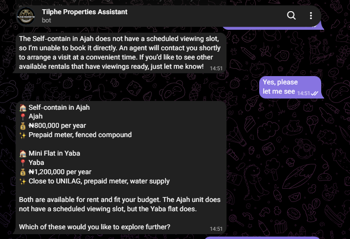
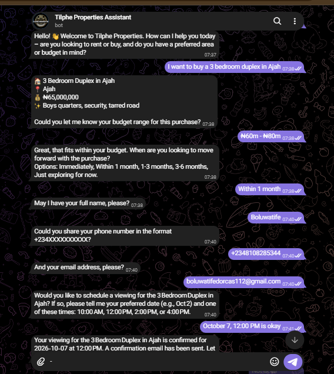
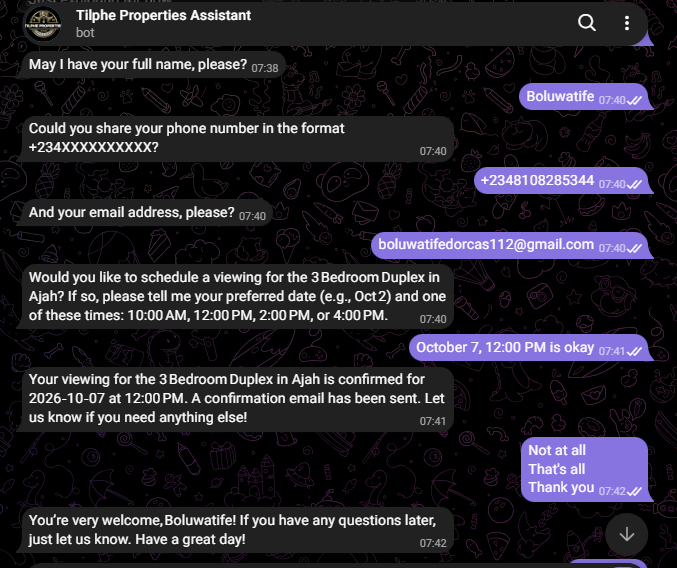
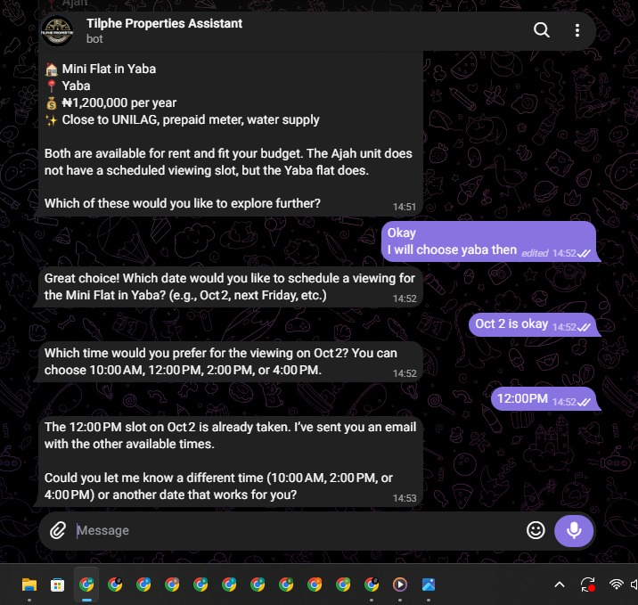
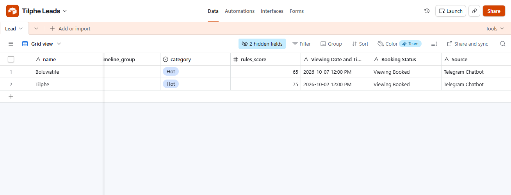
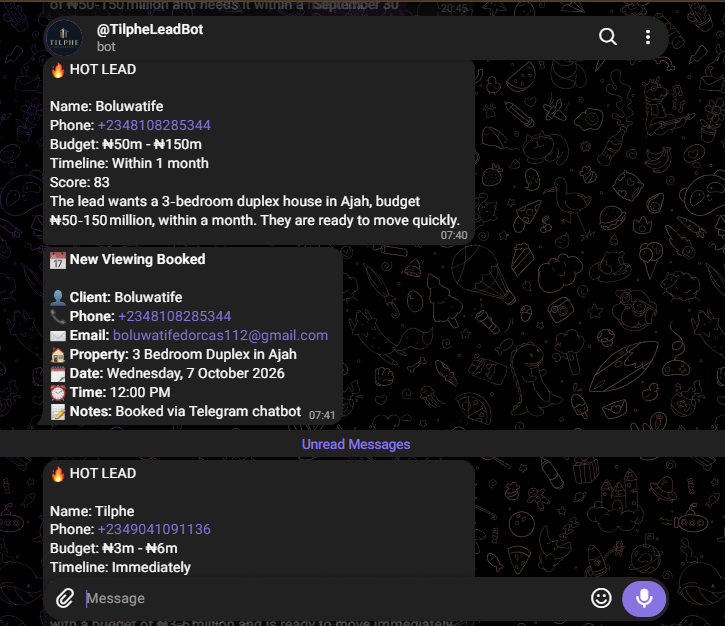
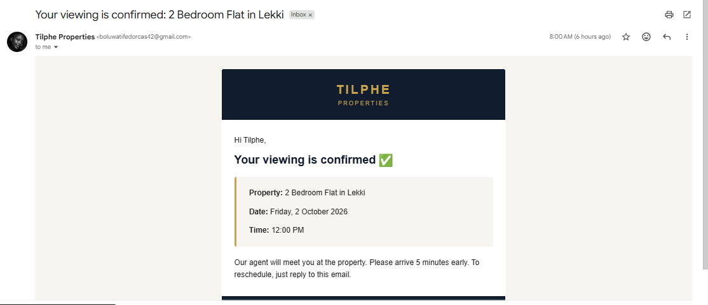
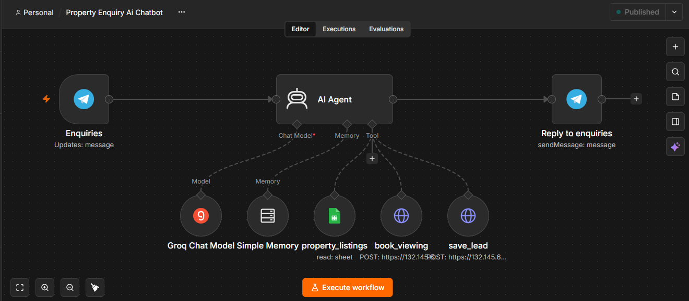

# AI Property Enquiry Chatbot

**An AI assistant that answers property enquiries, qualifies clients and books viewings, day and night, right inside Telegram.**

Built as a portfolio case study for **Tilphe Properties**, a demo real estate brand.


---

## The problem real estate agents face

Picture this. A client sees your listing at 10pm and messages: *"Is the 2 bedroom in Lekki still available?"*

You are asleep, or you are at a viewing. By the time you reply the next morning, that client has already spoken to three other agents.

This happens every day to agents and agencies:

- **Late replies lose clients.** The first agent to answer usually wins.
- **The same questions, again and again.** "Is it available?" "How much?" "Where exactly?" "Can I see it?"
- **Time wasted on people who are not serious.** Hours go into chats with people who were never going to rent or buy.
- **Double-booked viewings.** Two clients, one slot, and one very awkward phone call.
- **Nothing is written down.** Enquiries sit in WhatsApp chats and notebooks, and good leads get forgotten.

---

## The solution

A friendly AI assistant that works like a **front desk that never sleeps**. A client chats with it on Telegram (the same way they chat with a person), and it:

1. **Replies instantly**, any hour, in simple and polite English
2. **Shows the right properties**: only ones that are really available, matched to what the client wants
3. **Asks a few easy questions**: budget, when they want to move, and their contact details
4. **Checks your real calendar** and offers only the viewing times that are free
5. **Books the viewing**, sends the client a confirmation email, and alerts you on Telegram
6. **Grades every client as Hot, Warm or Cold**, so you know who to call first

| Grade | What it means |
|---|---|
| 🔥 **Hot** | Ready to move soon, with a budget that fits. Call today. |
| 🌤 **Warm** | Interested, planning to move in a few months. Follow up. |
| ❄️ **Cold** | Just looking. Saved for later, no alert. |

---

## What a conversation looks like

```
Client:    Do you have a mini flat in Yaba?
Assistant: Yes! Here is one:
           🏠 Mini Flat in Yaba
           📍 Yaba
           💰 ₦1,200,000 per year
           ✨ Close to UNILAG, prepaid meter, water supply
           What is your budget?
Client:    ₦1m - ₦1.5m
Assistant: Great, that fits. When would you like to move in?
Client:    Immediately
Assistant: May I have your full name, please?
   ...
Client:    Which time is free on Monday?
Assistant: 10:00 AM, 2:00 PM and 4:00 PM are free. Which do you prefer?
Client:    2pm
Assistant: Your viewing is confirmed for Monday at 2:00 PM.
           A confirmation email is on its way.
```

---

## What the agent receives

Without typing a single message, the agent gets:

- A **Telegram alert** for every Hot or Warm lead and every booked viewing
- A **tidy record** of every client: name, phone, email, budget, when they want to move, the property they liked, their grade, and their viewing time
- A **calendar** that fills itself, with no double bookings

---

## How it helps a real estate business

| Without the assistant | With the assistant |
|---|---|
| Enquiries at night wait until morning | Every enquiry gets an answer in seconds |
| Agent answers the same questions daily | The assistant handles the repeat questions |
| Agent can't tell who is serious | Every client is graded Hot, Warm or Cold |
| Viewings arranged by back-and-forth chats | Clients pick a free time and it is booked |
| Leads live in chats and notebooks | Every lead is saved in one place |
| Clients wait while the agent is busy | Nobody waits, even during viewings |

The agent keeps the human parts of the job: building trust, negotiating and closing. The assistant handles the repetitive first steps.

---

## Safe and honest by design

A bot that talks to your clients must never embarrass you. So this one is built to:

- **Show only available properties.** Rented and sold ones never appear.
- **Never make things up.** It uses only the real listings. No invented prices or details.
- **Offer only free viewing times.** It checks the real calendar first.
- **Say "booked" only when it really is.** The confirmation comes after the calendar says yes.
- **Pass sensitive topics to a human.** Price negotiation, legal and payment questions go to the agent.
- **Stay on topic.** It talks about your properties, nothing else.

---

## See it in action

### 1. The assistant recommends properties
A client asks for a flat. The assistant suggests only the available matches.



### 2. It collects the client's details
Budget, timeline, name, phone and email, one question at a time.



### 3. It shows only the times that are really free
The assistant checks the calendar before offering any time.


### 4. The viewing is booked
The client gets a clear confirmation.



### 5. A taken slot is never promised
If someone else took the time, the assistant says so and helps the client choose another.



### 6. The agent's lead record
Every client is saved with a grade, so the agent knows who to call first.



### 7. The agent's Telegram alert
The agent is notified the moment a hot lead or a booking comes in.



### 8. The client's confirmation email
A professional email goes out automatically.



### Behind the scenes
For the technical reader: the full workflow in n8n.



---

## Part of a bigger system

This chatbot is the front desk of a three-part real estate automation suite:

| Part | Its job |
|---|---|
| **Property Enquiry Chatbot** (this project) | Talks to clients, shows properties, takes details |
| **Lead Capture & Qualification** | Grades every lead Hot, Warm or Cold and notifies the agent |
| **Property Viewing Booking** | Books the viewing, emails the client, updates the record |

A small helper checks the calendar so the chatbot never offers a time that is taken.

Lead Capture & Qualification project: [ai-real-estate-lead-qualification](https://github.com/Tilphee/ai-real-estate-lead-qualification)

---

## What I tested

- A client asks for a property that matches → the right listings are shown
- The matching property is already rented or sold → it is hidden and the closest option is suggested
- A client gives all their details → one clean record is saved, with the right grade
- A client asks which times are free → only the really free times are listed
- A client picks a free time → the viewing is booked, the email and alert go out
- A client picks a taken time → the assistant says so and suggests other times
- A day with nothing booked, and a day that is fully booked → both handled correctly

---

## What went wrong along the way, and how I fixed it

Building this was not a straight line. These are the real problems I hit.

- **The assistant once invented an email address** when a client had not given one. I fixed it so it only saves details the client actually typed.
- **It listed viewing times from memory,** then said the time was taken. I connected it to the real calendar so it checks first.
- **It first answered with tables,** which Telegram cannot display. I changed it to short, clean messages.
- **It could not tell if a viewing was really booked.** I made the booking system report back "booked" or "busy", and the assistant now waits for that answer.
- **Free AI plans have limits.** Heavy testing slowed the replies. This is fine for a demo, but a live agency should use a paid plan.

---

## What I would add next

- Chat on **WhatsApp** and on the agency's **website**
- **Reminders** to clients before their viewing
- Hiding viewing times that have already passed today
- A weekly summary for the agent: new leads, hot leads, viewings booked

---

## Built with

n8n · Telegram · Groq AI · Google Sheets · Google Calendar · Airtable · Gmail

---

**Built by Tiphe**, AI Automation. Open to remote work and freelance projects.
