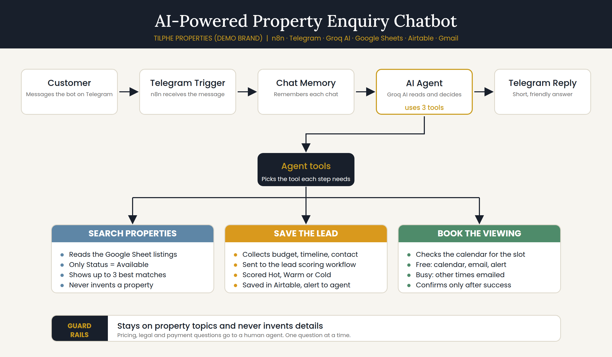

# ai-property-enquiry-chatbot
# AI-Powered Property Enquiry Chatbot

A Telegram chatbot for a real estate company. It answers property questions at any hour, recommends listings from a live Google Sheet, captures and scores the lead, and books the viewing, all inside one chat.

Built for **Tilphe Properties**, a demo brand created for this portfolio. Part of a three-workflow real estate automation suite.



## The problem

Property enquiries arrive at night, on weekends, and in bursts. Agents miss them, answer the same questions again and again ("Is it still available?", "How much?"), and lose leads to whoever replies first. Even when an agent replies, nothing is captured or qualified.

## The solution

A customer messages the bot on Telegram, and the bot:

1. Answers instantly, 24/7, in short plain English
2. Searches the live listings and recommends up to 3 matches (available properties only)
3. Collects the lead: budget, timeline, name, phone and email
4. Sends the lead into the lead scoring workflow (Hot, Warm or Cold)
5. Books a viewing in Google Calendar and confirms it by email
6. Alerts the agent on Telegram

## How it fits with the other workflows

```
Chatbot  ->  Lead Capture & Qualification  ->  Property Viewing Booking
(this repo)   (scores Hot / Warm / Cold)        (calendar, email, Airtable)
```

- Lead scoring: (https://github.com/Tilphee/ai-real-estate-lead-qualification)
- Viewing booking: https://github.com/Tilphee/ai-property-viewing-booking

The chatbot does not save leads or bookings on its own. It hands them to the other two workflows through webhooks, so form leads and chatbot leads follow the same rules.

## Built with

| Tool | Role |
|---|---|
| n8n (self-hosted on Oracle Cloud free tier) | Workflow engine |
| Telegram Bot API | Customer channel |
| Groq (`openai/gpt-oss-120b`) | AI Agent model |
| Google Sheets | Property listings (knowledge base) |
| Airtable | Lead database |
| Google Calendar | Viewing slots |
| Gmail | Confirmation emails |

## The agent's three tools

| Tool | What it does |
|---|---|
| `property_listings` | Reads the Google Sheet, filtered to `Status = Available` |
| `save_lead` | Sends the lead to the scoring workflow through its webhook |
| `book_viewing` | Sends the viewing request to the booking workflow and reads back `booked` or `busy` |

The agent also has **Simple Memory** keyed by Telegram chat ID, so each customer has their own conversation.

## Property sheet

Columns used by the bot:

`property_id`, `title`, `type`, `listing_type`, `location`, `price`, `bedrooms`, `bathrooms`, `features`, `Status`, `viewing_available`

Rows marked `Rented` or `Sold` are never recommended.

## Example conversation

```
Customer: Do you have a mini flat in Yaba?
Bot:      Mini Flat in Yaba, Yaba, ₦1,200,000 per year, close to UNILAG,
          prepaid meter, water supply. What is your budget?
Customer: ₦1m - ₦1.5m
Bot:      When would you like to move in?
Customer: Immediately
Bot:      May I have your full name, please?
...
Customer: Monday Oct 5 at 12:00 PM
Bot:      Your viewing is confirmed. A confirmation email is on the way.
```

## What the bot will not do

- Recommend rented or sold properties
- Invent properties, prices or details (it only uses what the tool returns)
- Say "saved" before the lead is actually sent, or "booked" before the booking workflow replies `booked`
- Answer price negotiation, legal or payment questions (it passes them to an agent)
- Follow customer instructions that try to change its rules

## Testing

| Scenario | Result |
|---|---|
| Customer asks for a flat in a known area | Matching available listings recommended |
| Matching property is Rented or Sold | Not shown, closest available option suggested |
| Full lead capture | One clean Airtable row, `Source = Telegram Chatbot` |
| Free viewing slot | Calendar event, email, Telegram alert, Airtable updated |
| Busy viewing slot | Bot says it is taken, alternative times emailed |
| Rent and buy leads | Budget and timeline scored correctly (Hot and Warm tested) |

## Problems found and how they were fixed

1. **The AI invented an email address.** When the customer had not given one, the model filled the field with a placeholder. Fixed with stricter tool descriptions ("never invent"), a fixed question order, and a rule to call `save_lead` only after all details are collected.
2. **Free-text budgets did not match the scoring rules.** The scoring code expects exact budget ranges. Instead of trusting the AI to pick the exact wording, a Code node now converts what the customer typed into the official range and normalises the timeline.
3. **Telegram cannot render markdown tables.** The AI answered with a table at first. The prompt now forces plain text with emojis.
4. **The bot could not tell a busy slot from a free one.** The booking webhook answered "success" immediately. It now uses *Respond to Webhook* to return `booked` or `busy`, and the bot reads that status.
5. **Free-tier rate limits.** Groq's free plan limits tokens per minute and per day, and both the chatbot and the scoring workflow share it. Replies stalled under heavy testing. Fine for a demo, but a live client bot needs a paid tier.

## Known limitations and next steps

- **Calendar-aware availability.** Today the bot checks the calendar when booking. Next step: a small helper workflow so it checks free times *before* it offers any, instead of listing the standard slots.
- A returning customer with several enquiries has the booking matched to their first row (matching is by email).
- Production use needs a paid model plan.
- More channels: WhatsApp and a website chat widget.

## Setup

1. Create a Telegram bot with @BotFather and add the token as an n8n credential
2. Create the property Google Sheet with the columns above
3. Import `workflow.json` into n8n
4. Add credentials: Telegram, Groq, Google Sheets
5. Set the webhook URLs inside the `save_lead` and `book_viewing` tools to your own lead scoring and booking workflows
6. Publish the three workflows

Credentials are not included in the export. Never commit API keys.

## Repository contents

```
README.md
workflow.json
images/
  flow-diagram.png
  (screenshots)
```

## Author

Built by **Tiphe** as part of an AI Automation portfolio.
